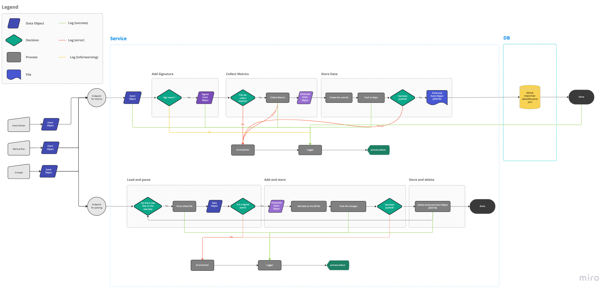

# Contributing <!-- omit in toc -->

Thank you for taking the time to contribute to **telemetry-functions**! We sincerely appreciate it. Before you start, please read our Code of Conduct to maintain an approachable and respectable community.

## Chapters

- [Chapters](#chapters)
- [New contributor guide](#new-contributor-guide)
- [Getting started](#getting-started)
  - [:file_folder: File Structure](#file_folder-file-structure)
- [Issues](#issues)
  - [Create a new issue](#create-a-new-issue)
  - [Solving an Issue](#solving-an-issue)
    - [Prerequisites](#prerequisites)
    - [Commits](#commits)
    - [Branch](#branch)

## New contributor guide

Before you get started, read the README to get an overview of the project. Here are some resources to help you begin contributing:

- [How to install git](https://git-scm.com/book/en/v2/Getting-Started-Installing-Git)
- [How to handle repositories](https://docs.gitlab.com/ee/user/project/repository/)
- [Creating an issue](https://docs.github.com/en/issues/tracking-your-work-with-issues/creating-an-issue)
- [Creating merge requests](https://docs.gitlab.com/ee/user/project/merge_requests/creating_merge_requests.html)

## Getting started

### :file_folder: File Structure

Our project has the following file structure:

    .
    └── .github           // GitLab CI/CD pipeline
    └── .netlify          // Dist folder created by Netlify CLI
    └── doc               // the documentation skeleton
    └── src
        └── core          // Core modules
        └── metrics       // Metrics collection modules
        └── shared        // Global configuration and log messages
    └── postman           // Postman collections
    └── netlify           // Netlify Serverless functions
    └── .env              // Env variables
    └── CHANGELOG.md      // This file is automatically created by the release stage of the main    pipeline. Please don't touch it.


## System Components Diagram



### System Description
#### DataEvents
 telemetry-functions operates on the basis of event objects. An event object (*DataEvent*) can be created either automatically by Github, manually, or by a Cronjob. Event objects represent a specific event that occurred, such as a pull request. Regardless of how it is created, event objects are sent to the endpoint URL provided by Netlify. 

#### Event Signatures
 Once the event object is received by the event handler, the event checked to see if it matches certain criteria for the type of events that the app is looking for. If the event is recognized, a signature is added to the event and it becomes a Signed Event Object. Signing an event is a way of classifying it, so that the app knows exactly what type of event it is and what the event object looks like. 

#### Metrics Signatures
After getting an event signature, the object is classified as a *Signed Event Object*. The signed object is then evaluated to see if it meets the conditions for metrics collection. Metrics conditions are unique for each metric. If the object meets the conditions, the metrics are collected from it and returned as an *Enhanced Data Event*. It's important to note that there may be more than one metric collected in each Enhanced Data Event, and different event types may share the same metric categories. 

New metrics can be added in `/src/metrics` with the following folder structure:
```
└── [metric_name]
    ├── __tests__
    ├── index.ts
    ├── interfaces.d.ts
    └── metricsConditions.ts
```

### Core Functions
Files in the `/src/core` folder are referred to as *Core Functions*. These functions provide services that are repeated for each metric and the functions themselves are metric-agnostic. These functions include:

- **addSignature**: adds the event signature to an data object
- **collectMetrics**: collects metrics from a signed data event
- **createDataEvent**: creates initial data event
- **errorCatcher**: catches errors process
- **logger**: logs activity
- **octokit**: interfaces with Github for data collection
- **storeData**: received an Enhanced Data Event, creates a commit, and pushes it to the data repo 

#### Store Data
The storeData function is the final step in the process 
## Issues

### Create a new issue

If you encounter a problem with the tool or documentation, please [first search if a related issue exists](https://github.com/deven-org/telemetry-functionss/issues) . If there is no existing issue, please create one using the Issues tab.

To write a useful issue, please ensure it is:

- _reproducible_: It should contain all the instructions needed to reproduce the same outcome.

- _specific_: It's important that it addresses one specific problem.

### Solving an Issue

Browse our [existing issues](https://github.com/deven-org/telemetry-functionss/issues) to find one that interests you. If you would like to work on an issue, you are welcome to open a Merge Request with a fix.


## Submissions
### Prerequisites

Before submitting any merge request, ensure your branch passes all tests:

```bash
npm run test
```

### Commits

All commits must comply with the [Conventional Commits specification](https://www.conventionalcommits.org/en/v1.0.0/).

### Branching

For contributions we are using [Gitflow as branching strategy](https://www.atlassian.com/git/tutorials/comparing-workflows/gitflow-workflow#:~:text=Gitflow%20is%20a%20legacy%20Git,software%20development%20and%20DevOps%20practices.).
