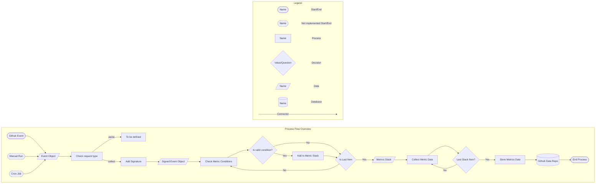

# Contributing <!-- omit in toc -->

Thank you for taking the time to contribute to **telemetry-functions**! We sincerely appreciate it. Before you start, please read our Code of Conduct to maintain an approachable and respectable community.

## Chapters

- [Chapters](#chapters)
- [New contributor guide](#new-contributor-guide)
- [Getting started](#getting-started)
  - [:file\_folder: File Structure](#file_folder-file-structure)
- [System Description](#system-description)
  - [System Flow Diagram](#system-flow-diagram)
  - [Data Events](#data-events)
  - [Event Signatures](#event-signatures)
  - [Metrics Signatures](#metrics-signatures)
  - [Core Functions](#core-functions)
    - [Store Data](#store-data)
  - [OAuth App](#oauth-app)
- [Issues](#issues)
  - [Create a new issue](#create-a-new-issue)
  - [Solving an Issue](#solving-an-issue)
- [Submissions](#submissions)
  - [Prerequisites](#prerequisites)
  - [Commits](#commits)
  - [Branching](#branching)
- [Development Tools](#development-tools)
  - [Postman](#postman)

## New contributor guide

Before you get started, read the README to get an overview of the project. Here are some resources to help you begin contributing:

- [How to install git](https://git-scm.com/book/en/v2/Getting-Started-Installing-Git)
- [How to handle repositories](https://docs.gitlab.com/ee/user/project/repository/)
- [Creating an issue](https://docs.github.com/en/issues/tracking-your-work-with-issues/creating-an-issue)
- [Creating merge requests](https://docs.gitlab.com/ee/user/project/merge_requests/creating_merge_requests.html)

## Getting started

### :file_folder: File Structure

Our project has the following file structure:

    .
    └── .github                // GitLab CI/CD pipeline
    └── .netlify               // Dist folder created by Netlify CLI
    └── aws
        └── lambda             // Amazon Lambda script
        └── lib                // Amazon CDK script
    └── bin                    // Amazon CDK script
    └── doc                    // the documentation skeleton
    └── src
        └── core               // Core modules
        └── metrics            // Metrics collection modules
        └── shared             // Global configuration and log messages
        └── trigger-signatures // Trigger identification modules
    └── postman                // Postman collections
    └── netlify                // Netlify Serverless functions
    └── .env                   // Env variables
    └── CHANGELOG.md           // This file is automatically created by the release stage of the main    pipeline. Please don't touch it.

Source folders and files should be named in kebab-case (e.g. `src/trigger-signatures/github-event-signature.ts`), while markdown files are in all caps `MARKDOWN.md`.

## System Description

### System Flow Diagram



### Data Events

telemetry-functions operates on the basis of event objects. An event object (_TriggerEvent_) can be created either automatically by Github, manually, or by a Cronjob. Event objects represent a specific event that occurred, such as a pull request. Regardless of how it is created, event objects are sent to the endpoint URL provided by Netlify.

### Event Signatures

Once the event object is received by the event handler, the event checked to see if it matches certain criteria for the type of events that the app is looking for. If the event is recognized, a signature is added to the event and it becomes a Signed Event Object. Signing an event is a way of classifying it, so that the app knows exactly what type of event it is and what the event object looks like.

### Metrics Signatures

After getting an event signature, the object is classified as a _Signed Event Object_. The signed object is then evaluated to see if it meets the conditions for metrics collection. Metrics conditions are unique for each metric. If the object meets the conditions, the metrics are collected from it and returned as an _Enhanced Data Event_. It's important to note that there may be more than one metric collected in each Enhanced Data Event, and different event types may share the same metric categories.

New metrics can be added in `/src/metrics` with the following folder structure:

```
└── [metric-name]
    ├── __tests__
    ├── index.ts
    ├── interfaces.d.ts
    └── metrics-conditions.ts
```

### Core Functions

Files in the `/src/core` folder are referred to as _Core Functions_. These functions provide services that are repeated for each metric and the functions themselves are metric-agnostic. These functions include:

- **addSignature**: adds the event signature to an data object
- **collectMetrics**: collects metrics from a signed data event
- **createTriggerEvent**: creates initial data event
- **errorCatcher**: catches errors process
- **logger**: logs activity
- **octokit**: interfaces with Github for data collection
- **storeData**: receives an Enhanced Data Event, creates a commit, and pushes it to the data repo

#### Store Data

The storeData function is the final step in the telemetry-functions process. storeData receives an Enhanced Data Event and uses the appropriate metadata, including repo name, repo owner, and metrics signature determine the path to store the information in the data repo. The path is based on data in the Enhanced Data Event, but also uses environment variables such as:

- `COMMITTER_NAME`
- `COMMITTER_EMAIL`
- `AUTHOR_NAME`
- `AUTHOR_EMAIL`

These variables are stored in Netlify for production, but when running the app locally, a `.env` file should be added to the root folder. The `.env` file should use the format established in the `/.env.template` file already in the repo.

The variable `CONFLICT_RETRIES` is used to define the number of attempts to store the data in the github repository. If it's not set it defaults to 0, that means there is no retry if the data can't be stored with the first attempt. For testing purposes the variable could also be set to -1, so that the data isn't stored at all.

### OAuth App

In order to access Github data, telemetry-functions uses a Githup OAuth App. This app gets added to a Github repo or organization from which data will be collected, and passes an authorization token to telemetry-functions. The token is then used during REST API requests to Github in for authentication.

## Issues

### Create a new issue

If you encounter a problem with the tool or documentation, please [first search if a related issue exists](https://github.com/deven-org/telemetry-functionss/issues) . If there is no existing issue, please create one using the Issues tab.

To write a useful issue, please ensure it is:

- _reproducible_: It should contain all the instructions needed to reproduce the same outcome.

- _specific_: It's important that it addresses one specific problem.

### Solving an Issue

Browse our [existing issues](https://github.com/deven-org/telemetry-functionss/issues) to find one that interests you. If you would like to work on an issue, you are welcome to open a Merge Request with a fix.

## Submissions

### Prerequisites

Before submitting any merge request, ensure your branch passes all tests:

```bash
npm run test
```

### Commits

All commits must comply with the [Conventional Commits specification](https://www.conventionalcommits.org/en/v1.0.0/).

### Branching

For contributions we are using [Gitflow as branching strategy](https://www.atlassian.com/git/tutorials/comparing-workflows/gitflow-workflow#:~:text=Gitflow%20is%20a%20legacy%20Git,software%20development%20and%20DevOps%20practices.).

## Development Tools

### Postman

During the development process, it may be helpful to mock Github events. This is possible through the software program [Postman](https://www.postman.com/), which allows developers to create mock HTTP requests sent to the endpoint of their choice. Header and body parameters (where applicable) are fully customizable by the developer. In the `/postman` folder, telemetry-functions contains a file that can be imported into Postman to easily set up the mock HTTP requests.
